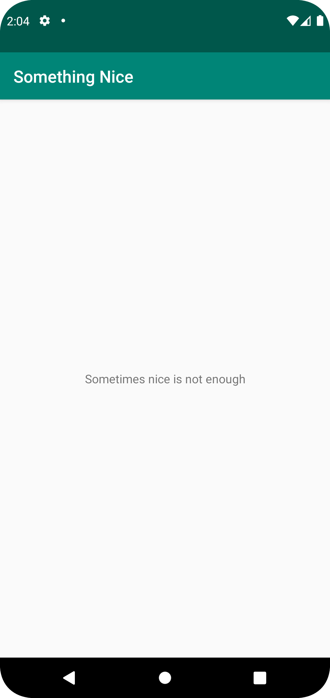

# Rapport

Jag ändrade namnet på app_name till "Sometimes nice is not enough" i filen strings.xml i values-mappen. Sedan ändrade jag labeln i AndroidManifest.xml till Something Nice och tog en screenshot av den
virtuella mobiltelefonen och lade i en egenskapad map vid namn Picture. Efteråt commitade jag och pushade projektuppdateringen till github. Jag fick även flytta bildens plats och ta bort den gamla mappen som jag lagt bilden i tidigare.


```
<resources>
    <string name="app_name">Sometimes nice is not enough</string>
</resources>
```




